I build privacy tools for people who shouldn't have to think about security.
The hard decisions get made in the code, not handed to the user.

Based in London. BSc Cybersecurity & Computer Science. Currently building
HexVault — a zero-knowledge IAM platform — plus a few open-source things below.

**How I build:** zero-knowledge by default · self-hosted infrastructure · security decided in code, not configuration.

---

**HexVault** · Zero-knowledge IAM platform · [hexvault.co.uk](https://hexvault.co.uk)

    

A password manager and identity platform where the server can't read anything
it stores. Web app, Chrome extension, desktop builds for Windows/Linux/macOS,
admin portal with RBAC, MFA/TOTP, audit logging, enterprise SSO.
Release notes: [hexvault-changelog](https://github.com/happygream/hexvault-changelog)

**[hexblock](https://github.com/happygream/hexblock)** · DNS filtering + WireGuard VPN

  

Blocks ads and trackers for a whole network. Nothing to install on devices.
One command sets up Docker, static IP, SSL, and the reverse proxy.

**[hexblock-shield](https://github.com/happygream/hexblock-shield)** · Browser extension

  

Handles what DNS can't reach — in-browser YouTube ads and sponsor segments.
EasyList compiled to declarativeNetRequest.

**[hexchat](https://github.com/happygream/hexchat)** · E2E encrypted messaging

   

Self-hosted, end-to-end encrypted. Voice, video, real-time, PWA.

**[dragnet](https://github.com/happygream/dragnet)** · Portable network scanner

   

Single portable Windows .exe — host discovery, TCP port scanning, TLS
inspection, HTTP header scoring, OS fingerprinting, honeypot detection.
Terminal UI built with Bubble Tea.

**[hexbrief](https://github.com/happygream/hexbrief)** · Morning dashboard

 

A desktop dashboard I open with my coffee.

**[OBSIDIAN](https://github.com/happygream/OBSIDIAN)** · Desktop security scanner for authorised pen testing

   

Wraps 13 open-source tools — nmap, nuclei, ffuf, sqlmap and more — behind one
GUI with live terminal output, severity-classified findings, and report export
to PDF/HTML/Markdown. For authorised testing only.

---

Mostly Python on the back end, vanilla JS on the front. Self-host most of
my own infrastructure. Reachable at michalemccarthy@googlemail.com/happygream@gmail.com
